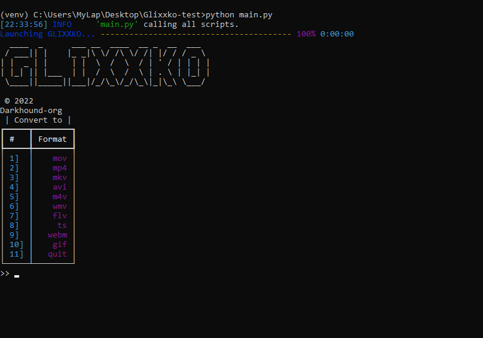

### Glixxko
```
  ____  _      ___ __  ____  __ _  __  ___
 / ___|| |    |_ _|\ \/ /\ \/ /| |/ / / _ \
| |  _ | |     | |  \  /  \  / | ' / | | | |
| |_| || |___  | |  /  \  /  \ | . \ | |_| |
 \____||_____||___|/_/\_\/_/\_\|_|\_\ \___/
 ```

[](https://www.python.org/)
[](http://ansicolortags.readthedocs.io/?badge=latest)

 A powerful python 🐍 cli video converter ✨. It utilises ffmpeg for converting.
 
 Try Glixxko online... [![badge](https://img.shields.io/badge/Try-Glixxko-579ACA.svg?logo=data:image/png;base64,iVBORw0KGgoAAAANSUhEUgAAAFkAAABZCAMAAABi1XidAAAB8lBMVEX///9XmsrmZYH1olJXmsr1olJXmsrmZYH1olJXmsr1olJXmsrmZYH1olL1olJXmsr1olJXmsrmZYH1olL1olJXmsrmZYH1olJXmsr1olL1olJXmsrmZYH1olL1olJXmsrmZYH1olL1olL0nFf1olJXmsrmZYH1olJXmsq8dZb1olJXmsrmZYH1olJXmspXmspXmsr1olL1olJXmsrmZYH1olJXmsr1olL1olJXmsrmZYH1olL1olLeaIVXmsrmZYH1olL1olL1olJXmsrmZYH1olLna31Xmsr1olJXmsr1olJXmsrmZYH1olLqoVr1olJXmsr1olJXmsrmZYH1olL1olKkfaPobXvviGabgadXmsqThKuofKHmZ4Dobnr1olJXmsr1olJXmspXmsr1olJXmsrfZ4TuhWn1olL1olJXmsqBi7X1olJXmspZmslbmMhbmsdemsVfl8ZgmsNim8Jpk8F0m7R4m7F5nLB6jbh7jbiDirOEibOGnKaMhq+PnaCVg6qWg6qegKaff6WhnpKofKGtnomxeZy3noG6dZi+n3vCcpPDcpPGn3bLb4/Mb47UbIrVa4rYoGjdaIbeaIXhoWHmZYHobXvpcHjqdHXreHLroVrsfG/uhGnuh2bwj2Hxk17yl1vzmljzm1j0nlX1olL3AJXWAAAAbXRSTlMAEBAQHx8gICAuLjAwMDw9PUBAQEpQUFBXV1hgYGBkcHBwcXl8gICAgoiIkJCQlJicnJ2goKCmqK+wsLC4usDAwMjP0NDQ1NbW3Nzg4ODi5+3v8PDw8/T09PX29vb39/f5+fr7+/z8/Pz9/v7+zczCxgAABC5JREFUeAHN1ul3k0UUBvCb1CTVpmpaitAGSLSpSuKCLWpbTKNJFGlcSMAFF63iUmRccNG6gLbuxkXU66JAUef/9LSpmXnyLr3T5AO/rzl5zj137p136BISy44fKJXuGN/d19PUfYeO67Znqtf2KH33Id1psXoFdW30sPZ1sMvs2D060AHqws4FHeJojLZqnw53cmfvg+XR8mC0OEjuxrXEkX5ydeVJLVIlV0e10PXk5k7dYeHu7Cj1j+49uKg7uLU61tGLw1lq27ugQYlclHC4bgv7VQ+TAyj5Zc/UjsPvs1sd5cWryWObtvWT2EPa4rtnWW3JkpjggEpbOsPr7F7EyNewtpBIslA7p43HCsnwooXTEc3UmPmCNn5lrqTJxy6nRmcavGZVt/3Da2pD5NHvsOHJCrdc1G2r3DITpU7yic7w/7Rxnjc0kt5GC4djiv2Sz3Fb2iEZg41/ddsFDoyuYrIkmFehz0HR2thPgQqMyQYb2OtB0WxsZ3BeG3+wpRb1vzl2UYBog8FfGhttFKjtAclnZYrRo9ryG9uG/FZQU4AEg8ZE9LjGMzTmqKXPLnlWVnIlQQTvxJf8ip7VgjZjyVPrjw1te5otM7RmP7xm+sK2Gv9I8Gi++BRbEkR9EBw8zRUcKxwp73xkaLiqQb+kGduJTNHG72zcW9LoJgqQxpP3/Tj//c3yB0tqzaml05/+orHLksVO+95kX7/7qgJvnjlrfr2Ggsyx0eoy9uPzN5SPd86aXggOsEKW2Prz7du3VID3/tzs/sSRs2w7ovVHKtjrX2pd7ZMlTxAYfBAL9jiDwfLkq55Tm7ifhMlTGPyCAs7RFRhn47JnlcB9RM5T97ASuZXIcVNuUDIndpDbdsfrqsOppeXl5Y+XVKdjFCTh+zGaVuj0d9zy05PPK3QzBamxdwtTCrzyg/2Rvf2EstUjordGwa/kx9mSJLr8mLLtCW8HHGJc2R5hS219IiF6PnTusOqcMl57gm0Z8kanKMAQg0qSyuZfn7zItsbGyO9QlnxY0eCuD1XL2ys/MsrQhltE7Ug0uFOzufJFE2PxBo/YAx8XPPdDwWN0MrDRYIZF0mSMKCNHgaIVFoBbNoLJ7tEQDKxGF0kcLQimojCZopv0OkNOyWCCg9XMVAi7ARJzQdM2QUh0gmBozjc3Skg6dSBRqDGYSUOu66Zg+I2fNZs/M3/f/Grl/XnyF1Gw3VKCez0PN5IUfFLqvgUN4C0qNqYs5YhPL+aVZYDE4IpUk57oSFnJm4FyCqqOE0jhY2SMyLFoo56zyo6becOS5UVDdj7Vih0zp+tcMhwRpBeLyqtIjlJKAIZSbI8SGSF3k0pA3mR5tHuwPFoa7N7reoq2bqCsAk1HqCu5uvI1n6JuRXI+S1Mco54YmYTwcn6Aeic+kssXi8XpXC4V3t7/ADuTNKaQJdScAAAAAElFTkSuQmCC)](https://hub-binder.mybinder.ovh/user/darkhound-org-glixxko-j412lk52/lab)

 * [DOWNLOAD]()
 * [DEVELOPING AND RUNNING]()
 * [USAGE]()
 * [LICENSE]()

 #### Download
 Download the latest source code of the app from [releases](https://github.com/Darkhound-org/Glixxko/releases) or clone the repo `https://github.com/Darkhound-org/Glixxko.git`. Download dir-tree.exe and ffmpeg.exe from [releases](https://github.com/Darkhound-org/Glixxko/releases).
Make sure all files are properly organized like in the directory tree below.
```
Glixxko/
    |
    |--- elements/
    |            |
    |            |--- info.txt
    |            |--- sfx_coin_double1.wav
    |            |--- sfx_menu_move4.wav
    |            |--- sfx_sounds_error1.wav
    |            |--- sfx_sounds_interaction21.wav
    |            |--- sfx_sounds_pause4_in.wav
    |            |--- sfx_sound_poweron.wav
    |            └── sfx_sound_shutdown1.wav
    |
    |---    .gitattributes
    |---     avi.py
    |---    choice.py
    |---     console.py
    |---     elements
    |---     ffmpeg.exe
    |---     flv.py
    |---     gif.py
    |---     LICENSE
    |---     m4v.py
    |---     main.py
    |---     mkv.py
    |---     mov.py
    |---     mp4.py
    |---     README.md
    |---     requirements.txt
    |---     runtime.txt
    |---     start.py
    |---     ts.py
    |---     version-info.txt
    |---     webm.py
    |---     dir-tree.exe
    └──     wmv.py


```
#### Developing 
Requirement:
   * [Python](https://www.python.org/downloads/) 👈

Fire up your favourite terminal and cd to the repo. Make a new `venv`, activate it and install the requirement by running `pip install -r requirements.txt`. [This may take a while...⚙️]

Now run the app `python main.py`😜

#### Usage
##### Supported formats
Glixxko supports all the formats mentioned below. More formats will be added in future releases.
```
┏━━━━━┳━━━━━━━━┓
┃ #   ┃ Format ┃
┡━━━━━╇━━━━━━━━┩
│ 1]  │    mov │
│ 2]  │    mp4 │
│ 3]  │    mkv │
│ 4]  │    avi │
│ 5]  │    m4v │
│ 6]  │    wmv │
│ 7]  │    flv │
│ 8]  │     ts │
│ 9]  │   webm │
│ 10] │    gif │
│ 11] │   quit │
└─────┴────────┘
```
Just enter your choice and select a file [give file path or just press enter for selecting with file dialog].
Progress bars may be different according to your terminal. 



#### License
Glixxko is licensed under the [Apache License 2.0](LICENSE)


 
